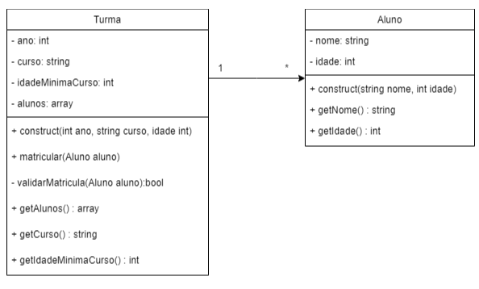

# Sistema de Matrícula de Alunos
  Nesta atividade de Programação Orientada a Objetos no meu curso de Análise e Desenvolvimento de Sistemas, o objetivo era criar um sistema de matriculas em que o aluno é matriculado em determinada turma após passar por uma validação de idade estipulada por cada curso.
## Diagrama de Classes

## Linguagens utilizadas
  PHP

